# colony_counter

Automatic classification of virus-infected cell cultures from well-plate images.

This repository contains the executable files (for **macOS**, **Linux**, and **Windows**) to run the automatic bacteria / cell-death classifier without requiring any interaction with Python.

---

## Authors

- **Simon Seyfert**  
- **Lina Groß**  
- **Vidhi Oswal**

For questions or issues, feel free to contact:  
📧 **simon.seyfert@epfl.ch**

---

## How to install
0. Note that this installation guide is only tested on/for windows. 
1. Click on the latest release
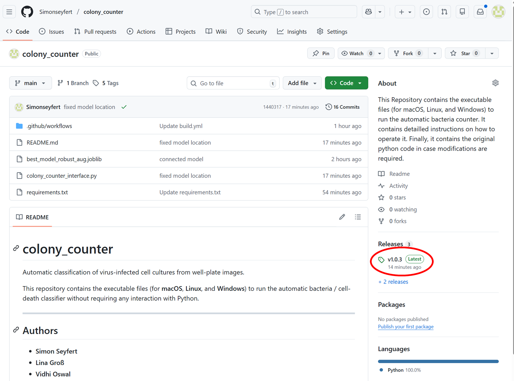

2. Click on the "best_model_robust_aug.joblib" to start the download. 
For windows: Click on ColonyCounter-windows.exe to start the download.
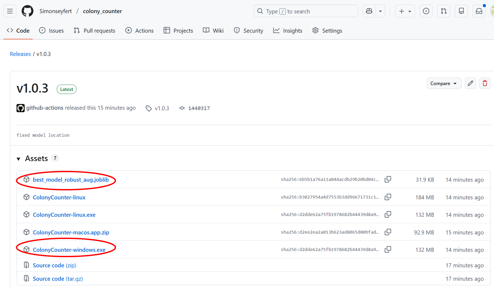

3. Place the two files in the same folder. If not, the model will not be found.
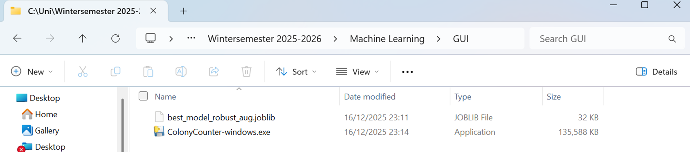

## How to run
1. When running for the first time the following appears. First click on "More info", then select "Run Anyway"
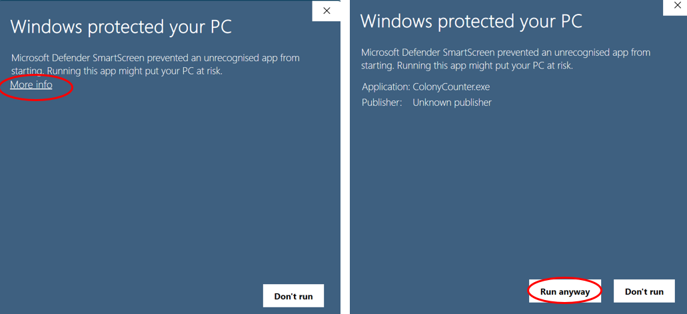

2. The following window appears. It can be resized like any other windows program. Now click on Open Images to open the images (shocking right)
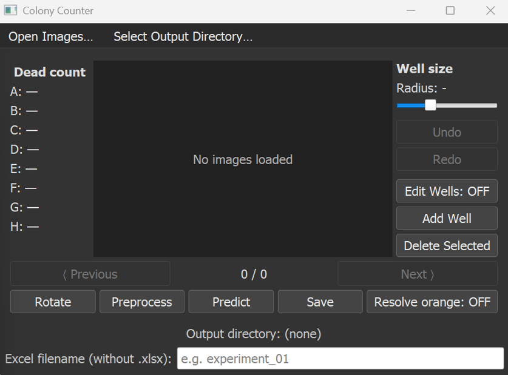

3. Select the images by simply clicking on them. To select multiple hold ctrl while selecting. Then click on "open".
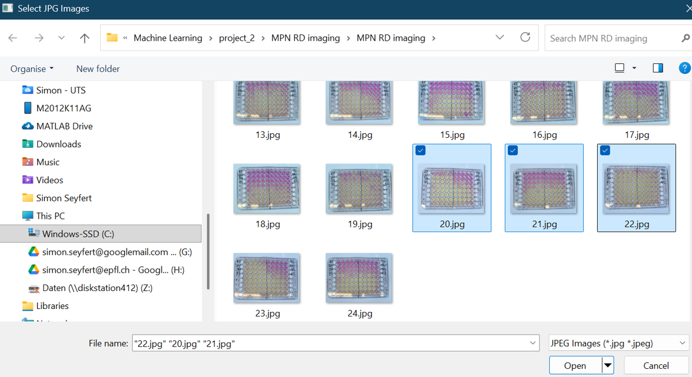

4. You can skip throug the images by clicking "Next" and "Previous". Importantly, images should be rotated (by clicking "Rotate") such that they appear in the same orientation as here
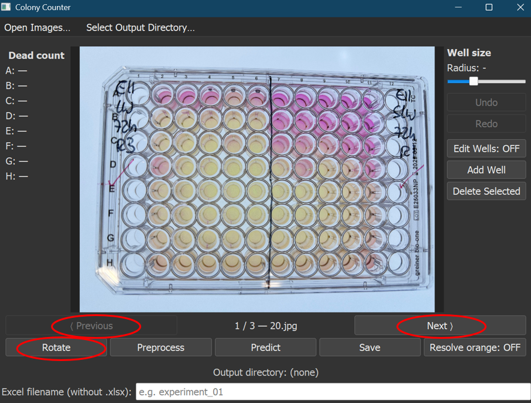

5. Click on "Preprocess"
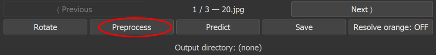

6. The following view appears. Skip through the images ("Next" and "Previous") to identify wrongly identified wells. Here in row E some wells are not identified correctly.
To change this, click on "Edit Wells: OFF" such that it switches to "On". 
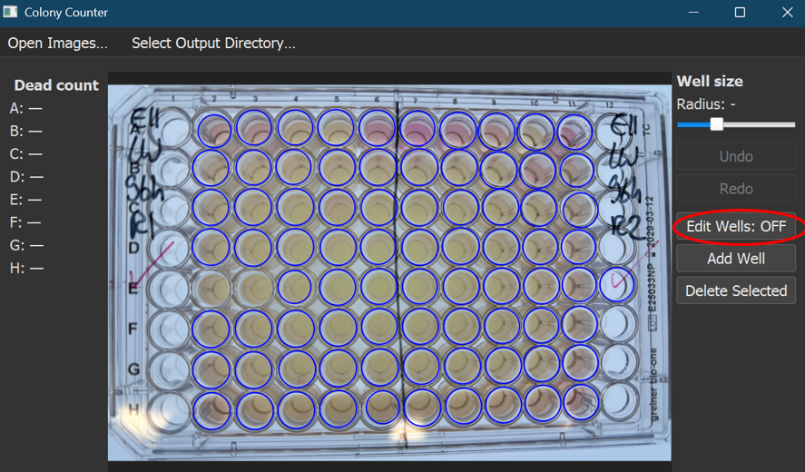

7. To delete wells, select the well (it turns black) and then click on "Delete Selected".
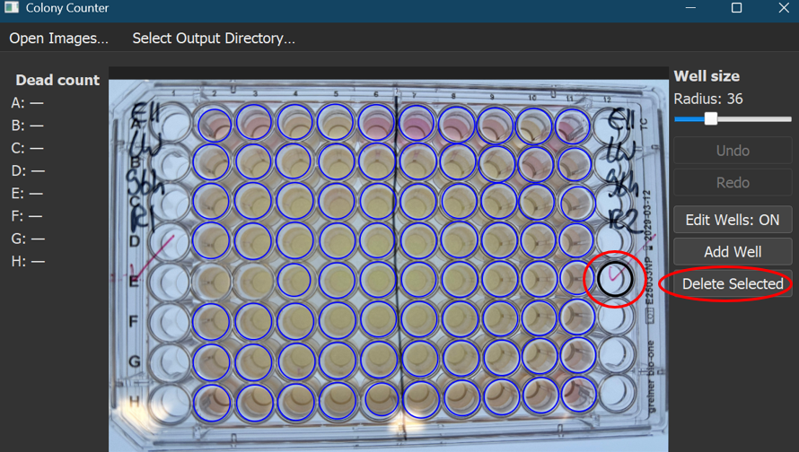

8. To add new wells, click on "Add Well". Then click on the newly added well and move it to the correct position. 
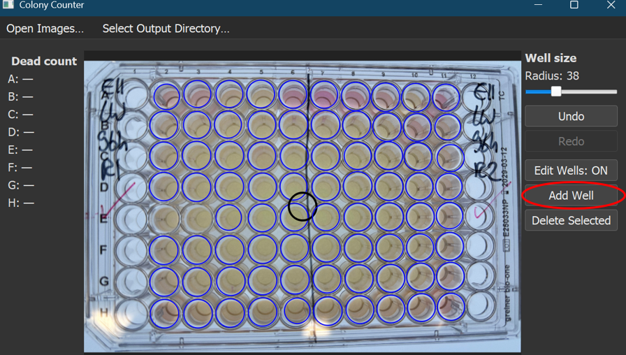

9. To Change the size of the well, select the well and use the slider.
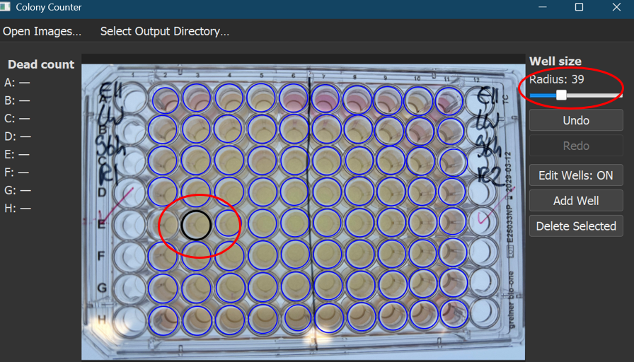

10. Repeat this until all wells are correct. Then click on "Predict"
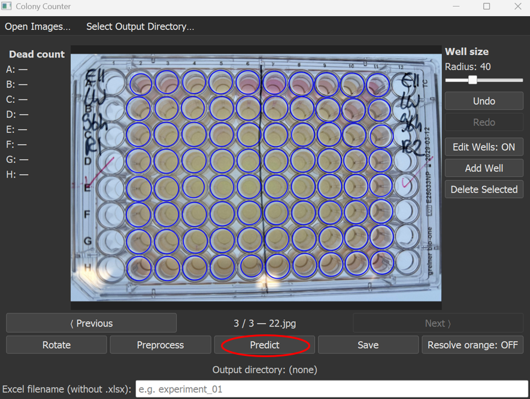

Note: all prediction steps have to be done for each image (that includes clicking on "Predict" for each image)

11. Explanation Overview:
Red = Infected (label 1), green = not infected (label 0), orange/yellow = model is unsure
Note: The prediction does not always work as intended. Not only orange/yellow cells might be wrong!
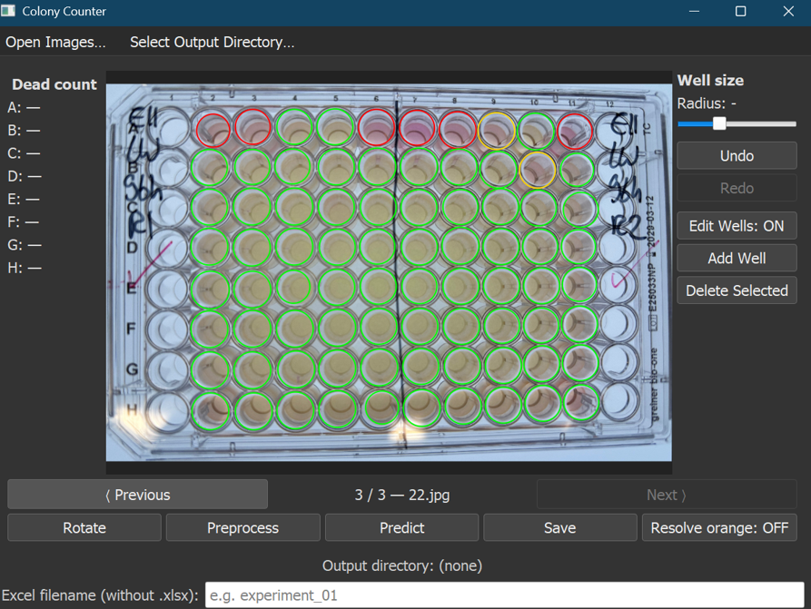

12. Now the user can automatically resolve the orange cases by clicking on "Resolve orange: OFF". This shows what the model thinks is more likely. As soon as the ambigious cases are resolved, the count per row is displayed
Note: the orange cells reappear after clicking on that button again
Note: when you have manually changed classifications, click on "Predict" again to undo
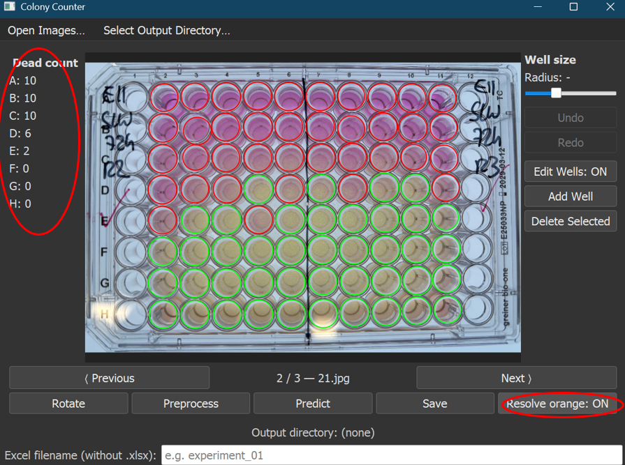

Note: Cells that show significant reflection are detected by the model and not classified --> they have to be resolved manually, see next step

13. The user can also manually change the labels. Therefore it is necessary to set "Edit Wells" into the "OFF" state! Then the state can be changed by simply clicking on the respective well.
Note: to go back to the model's prediction click on "Predict" again
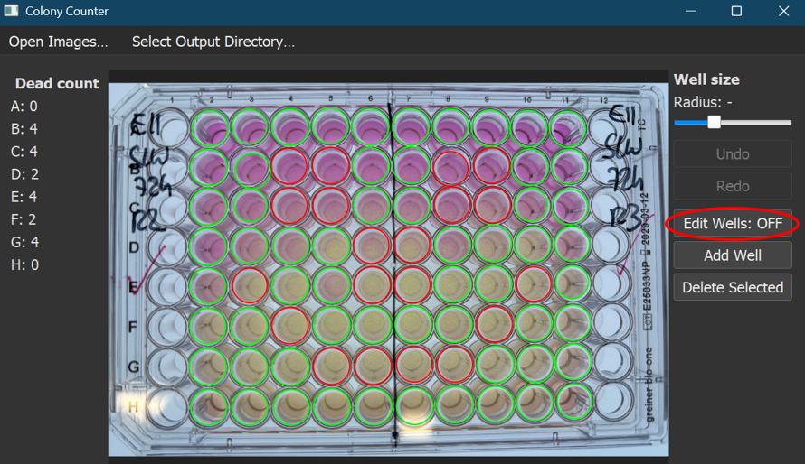

14. Select the output directory by clicking on "Select Output Directory"
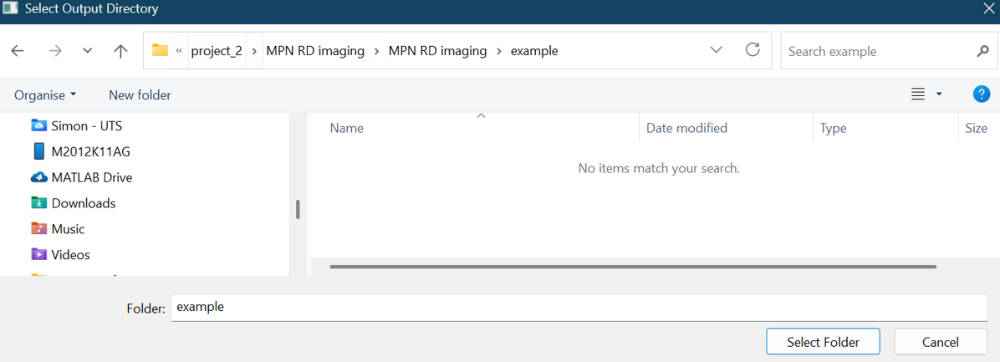

15. Give the excel output file a name
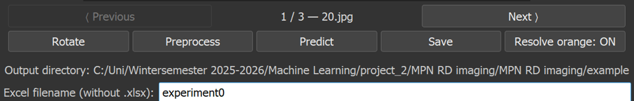

16. Click on save once the image has been classified correctly. This will create the excel output file. 
Note: When the excel file is opened, the save function might not work
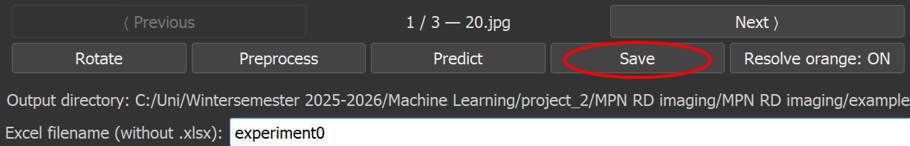

17. Repeat steps 10 to 13 and step 16 for all images

18. Each image will appear in a separate excel sheet
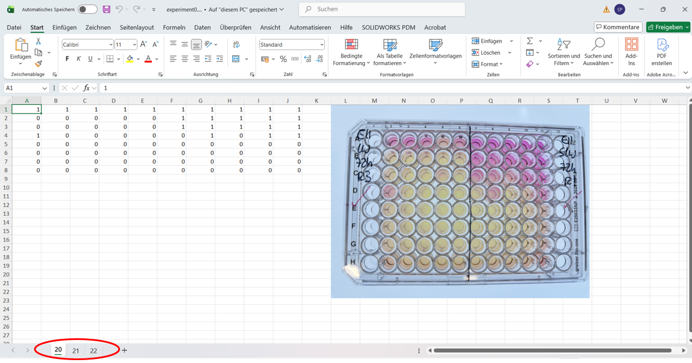

19. Oh yeah and there is an undo and redo button. They may not work everytime you hope they would work, I didn't check all possible events - apologies here

## Repository Structure

```text
colony_counter/
│
├── data/                    
│   └── images_readme/              # Images shown in the README file
│
├── colony_counter_interface.py     # Python source code
│
├── best_model_robust_aug.joblib    # Model used in interface
│
├── requirements.txt                # Python dependencies
└── README.md
